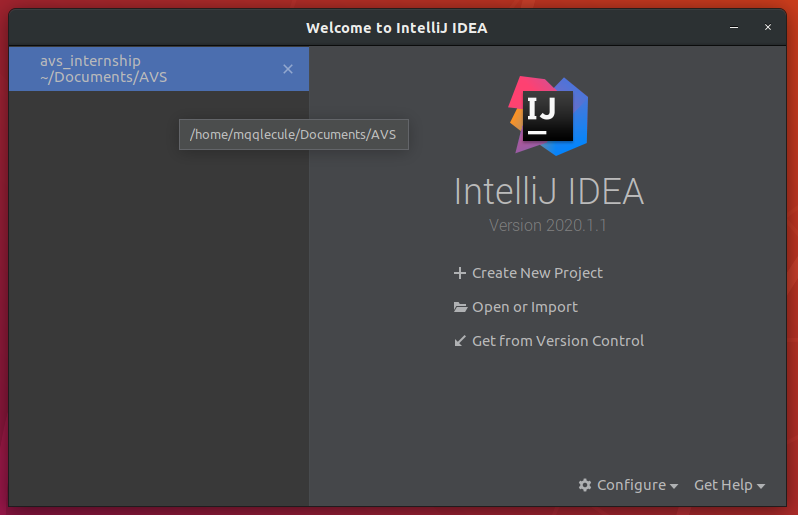
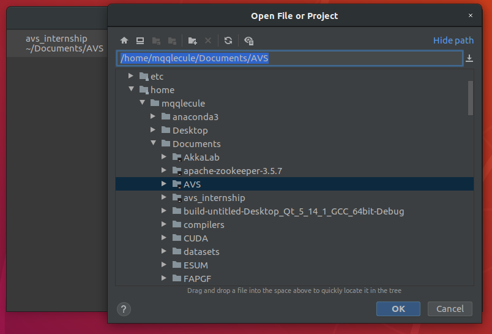
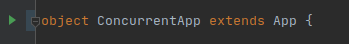

# AVSystems Scala/Java Internship Task
Author: Michał Dygas
email: michaldygaz@protonmail.com

## Requirements
- Java Version 1.8.0_242
- Scala Version 2.13.2
- sbt 1.3.10

compatible with IDE:
- Intellij 2020.1

## Intro

This project is a projection of AVS internship exercise. 

System has been designed to work concurrently (all classes are also implemented with Runnable interface).

To prevent data races in concurrent variant, I have decided to enhance ArrayBlockingQueue from java.utils to also support switching items between two queues.
The decision was dictated mostly by lack of required features, for example inserting item at concrete place to queue.  

## Packages

- ### java.avs.concurrent 
    this package contains enhanced versions of typical collections
    - **ArrayBlockingQueue** 
    - **SwitchableBlockingQueue** - implements switch feature between two queues that is thread safe
    - **TruckQueue** - extends SwitchableBlockingQueue with tracking delay of all entries in queue
- ### scala.avs.gateway
    - **ConsoleApp** - console application that directs GatewaySystem synchronously. For more details see **_ConsoleApp commands_** section 
    - **ConcurrentApp** - Runnable system example
    - **Config** 
        - **_DEBUG_** - to run application in debug mode (display logs from gateways)
        - **_stepMs_** - how long time step takes at StepWeightCheck 
    - **document**
        contains implementation of Document Gateway
        - **Document** - document representation
        - **DocumentCheck** - runnable document gateway
        - **StepDocumentCheck** - synchronous document gateway
        
    - **factory**
        - **CustomServiceFactory** - implement tho methods:
            - **_twoWeightCheckGatewaysFactoryMethod()_** - creates gateway systems' elements that are implementing Runnable interface
            - **_stepTwoWeightCheckGatewaysFactoryMethod()_** - creates synchronous gateway system
    - **generator** - classes that purpose is to generate Trucks
        - **TrafficGenerator** - runnable generator
        - **TrafficStepGenerator** - synchronous generator
    - **provision**
        strategies of load balancing Trucks between TruckQueues that ends in WeighCheckGateway
        - **BlockingProvisionTraffic2** - strategy, that uses blocking operations on queues (if picked queue is full, it will wait for a free space)
        - **ProvisionTraffic2** - synchronous implementation of routing strategy. Picks the queue with the lower sum of entries weight. If picked queue is full, then tries to insert Truck to other queue   
    - **step** 
        - **TStep** - step interface
    - **system**
        - **CustomServiceSystem** - controls step flow in synchronous  
    - **truck** - representation of Truck in system
    - **weight**
        - **StepWeightCheck** - synchronous weight check gateway implementation
        - **WeightCheck** - weight check gateway that implements Runnable interface
       
     

## Run

### Terminal
```$xslt
    cd avs_internship/
    sbt run
```
Select app version:

```
Multiple main classes detected, select one to run:

 [1] avs.gateway.ConcurrentApp
 [2] avs.gateway.ConsoleApp
```

### IntelliJ
1. Click ```open and import``` button

    
2. Then select project location 

    
3. To build project click hammer icon (and then click green arrow icon to run selected version)

    
4.  Or run specific version by clicking green arrow next to the object .*App declaration

    

## ConsoleApp commands


      switch <INDEX>         - switching entries between TruckQueues at specific index
      list   <ID>            - prints all entries assigned to queue with specific id
      delay  <ID>            - prints delay for truck that ID is <ID>
      delay  <ID> <INDEX>    - prints delay for entry specified by queue <ID> and position <INDEX>
      step                   - next step in the system
      step   <COUNT>         - next <COUNT> steps in the system
      step   --nogen         - step without generating random truck
      step   --nogen <COUNT> - next <COUNT> steps without generating random truck
      arrive <WEIGHT>        - generate Truck with specific weight
      

## Tutorial

This brief tutorial will teach You typical gateway workflow.

#### 1. Generate truck with 1200 weight in a current step. 

```
>> arrive 1200
    [GENERATOR] generated: Truck(Document(true),1200,1)
```
Output tells us that Truck with valid documents has been generated and assigned to ID 1

#### 2. Finish step.

```
>> step
    [DOCUMENT-CHECK] id: 1 that weights 1200 has arrived at DC
    [DOCUMENT-CHECK] id: 1 has been accepted and provisioned to queue 2, current delay: 1200
    [GENERATOR] generated: Truck(Document(true),5723,2)
```
Output tells us that Truck with ID 1 has been accepted by Document Gateway and forwarded to queue number 2.
Also new truck has been generated by default. Flag ```--nogen``` combined with ```step``` command prevents from generating random truck in current step. 

#### 3. List queues statuses. 

```
>> list 1
    WC <= d: 0 <= DC C: 0
>> list 2
    WC <= d: 0 <= [ ID 1 W: 1200 D: true ] <= DC C: 1
```

It tells us that the truck with ID: 1 is assigned to queue number 2, also it will be weighted in next step.
The queue number 1 is empty.

#### 4. Generate another two trucks and trigger next step.

```
>> arrive 1001
    [GENERATOR] generated: Truck(Document(true),1001,3)
>> arrive 1040
    [GENERATOR] generated: Truck(Document(true),1040,4)
>> step --nogen
    [WEIGHT-CHECK 2] id: 1 with weight 1200 has arrived at WC
    [WEIGHT-CHECK] id: 1 with remaining 200 timeunits in next step
    [DOCUMENT-CHECK] id: 2 that weights 5723 has arrived at DC
    [DOCUMENT-CHECK] id: 2 has been accepted and provisioned to queue 1, current delay: 5723
    [DOCUMENT-CHECK] id: 3 that weights 1001 has arrived at DC
    [DOCUMENT-CHECK] id: 3 has been accepted and provisioned to queue 2, current delay: 1201
    [DOCUMENT-CHECK] id: 4 that weights 1040 has arrived at DC
    [DOCUMENT-CHECK] id: 4 has been accepted and provisioned to queue 2, current delay: 2241
```

#### 5. Check queues status.

```
>> list 1
    WC <= d: 0 <= [ ID 2 W: 5723 D: true ] <= DC C: 1
>> list 2
    WC <= d: 200 <= [ ID 3 W: 1001 D: true ] <= [ ID 4 W: 1040 D: true ] <= DC C: 2
``` 

We might now notice that the truck assigned to queue 2 is still stuck on Weight Check Gateway.
It's because, one step is equal to **1000** weight units (Config.stepMs property). The sum of current delay for trucks is queues is respectively equal 5723 and 2241 (see current delay from a previous step)

#### 6. In this section we will learn how to switch Trucks between queues. 

First insert more trucks:
```
>> arrive 1002
    [GENERATOR] generated: Truck(Document(true),1002,5)
>> arrive 1050
    [GENERATOR] generated: Truck(Document(true),1050,6)
>> arrive 1060
    [GENERATOR] generated: Truck(Document(true),1060,7)
>> step --nogen
    [WEIGHT-CHECK 1] id: 2 with weight 5723 has arrived at WC
    [WEIGHT-CHECK] id: 2 with remaining 4723 timeunits in next step
    [WEIGHT-CHECK 2] id: 1 with weight 1200 has been let in
    [DOCUMENT-CHECK] id: 5 that weights 1002 has arrived at DC
    [DOCUMENT-CHECK] id: 5 has been accepted and provisioned to queue 2, current delay: 2243
    [DOCUMENT-CHECK] id: 6 that weights 1050 has arrived at DC
    [DOCUMENT-CHECK] id: 6 has been accepted and provisioned to queue 2, current delay: 3293
    [DOCUMENT-CHECK] id: 7 that weights 1060 has arrived at DC
    [DOCUMENT-CHECK] id: 7 has been accepted and provisioned to queue 2, current delay: 4353
>> list 1
    WC <= d: 4723 <= DC C: 0
>> list 2
    WC <= d: 0 <= [ ID 3 W: 1001 D: true ] <= [ ID 4 W: 1040 D: true ] <= [ ID 5 W: 1002 D: true ] <= [ ID 6 W: 1050 D: true ] <= [ ID 7 W: 1060 D: true ] <= DC C: 5
```
Wait, wait, wait - what just has happened? The Document Gateway is smart enough to route all trucks to queue number 2. It is caused by the heaviest truck assigned to queue 1. All new entries will wait less in queue number 2, cause their combined weight sum is less than the other truck.
But if we add more trucks, they will be routed to queue number 1.

#### 7. **Switching** part!

```
>> arrive 1
    [GENERATOR] generated: Truck(Document(true),1,8)
>> arrive 2
    [GENERATOR] generated: Truck(Document(true),2,9)
>> arrive 3
    [GENERATOR] generated: Truck(Document(true),3,10)
>> step --nogen
    [WEIGHT-CHECK] id: 2 with remaining 3723 timeunits in next step
    [WEIGHT-CHECK 2] id: 3 with weight 1001 has arrived at WC
    [WEIGHT-CHECK] id: 3 with remaining 1 timeunits in next step
    [DOCUMENT-CHECK] id: 8 that weights 1 has arrived at DC
    [DOCUMENT-CHECK] id: 8 has been accepted and provisioned to queue 2, current delay: 3354
    [DOCUMENT-CHECK] id: 9 that weights 2 has arrived at DC
    [DOCUMENT-CHECK] id: 9 has been accepted and provisioned to queue 1, current delay: 3725
    [DOCUMENT-CHECK] id: 10 that weights 3 has arrived at DC
    [DOCUMENT-CHECK] id: 10 has been accepted and provisioned to queue 1, current delay: 3728
>> list 1
    WC <= d: 3723 <= [ ID 9 W: 2 D: true ] <= [ ID 10 W: 3 D: true ] <= DC C: 2
>> list 2
    WC <= d: 1 <= [ ID 4 W: 1040 D: true ] <= [ ID 5 W: 1002 D: true ] <= [ ID 6 W: 1050 D: true ] <= [ ID 7 W: 1060 D: true ] <= [ ID 8 W: 1 D: true ] <= DC C: 5
```
Right now we are in good position to test this feature:
```
>> switch 1
>> list 1
    WC <= d: 3723 <= [ ID 9 W: 2 D: true ] <= [ ID 5 W: 1002 D: true ] <= DC C: 2
>> list 2
    WC <= d: 1 <= [ ID 4 W: 1040 D: true ] <= [ ID 10 W: 3 D: true ] <= [ ID 6 W: 1050 D: true ] <= [ ID 7 W: 1060 D: true ] <= [ ID 8 W: 1 D: true ] <= DC C: 5
```
You might notice that the trucks at second position has changed - it is because position index starts at 0.

Unfortunately switching trucks at position 0 doesn't work - they are preparing to enter the gateway. so they can not be switched.

```
>> switch 0
>> list 1
    WC <= d: 3723 <= [ ID 9 W: 2 D: true ] <= [ ID 5 W: 1002 D: true ] <= DC C: 2
>> list 2
    WC <= d: 1 <= [ ID 4 W: 1040 D: true ] <= [ ID 10 W: 3 D: true ] <= [ ID 6 W: 1050 D: true ] <= [ ID 7 W: 1060 D: true ] <= [ ID 8 W: 1 D: true ] <= DC C: 5
```

#### 8. Finally, try the ```delay``` command.

For this purpose I have generated 20 further steps by command ``` step 20```:

```
>> list 1
    WC <= d: 464 <= [ ID 7 W: 5585 D: true ] <= [ ID 8 W: 7112 D: true ] <= [ ID 11 W: 4301 D: true ] <= [ ID 12 W: 9597 D: true ] <= [ ID 14 W: 9699 D: true ] <= DC C: 5
>> list 2
    WC <= d: 7958 <= [ ID 9 W: 6004 D: true ] <= [ ID 10 W: 9639 D: true ] <= [ ID 13 W: 5822 D: true ] <= [ ID 15 W: 8389 D: true ] <= [ ID 16 W: 6979 D: true ] <= DC C: 5
>> delay 11
    delay: 17462
>> delay 1 2
    17462
>> switch 2
>> delay 11
    27902
>> delay 2 2
    27902
```

